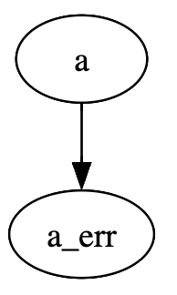

[](https://pypi.python.org/pypi/modeldag)
[](https://modeldag.readthedocs.io/en/latest/?badge=latest)

# modeldag
DataFrame generator through simple dictionary forming a direct acyclic graph (DAG)

# Installation

```bash
pip install modeldag
```

## Dependency
- numpy
- pandas
- graphviz (optional, used for visualize)

# Concept

Build a simple dictionary forming a DAG (this is the `model`) and call `mdag = ModelDAG(model)`.

The model dictionary is a simple nested directory with the following format: 
```python
model = {key1 : {'func': func, 'kwargs': dict, 'as': None_str_list'},
         key2 : {'func': func, 'kwargs': dict, 'as': None_str_list'},
         ...
         }
```

ModelDAG will read this dictionary to create a pandas.DataFrame with each column called `as` (if given, `key` is used as name otherwise ). The dataframe columns are generated calling `func(**kwargs)`. 

**The trick** of *modeldag* is that you can use `"@key1"` in kwargs of `key2` to use key1 generated values as input of key2 model. Furthermore *modeldag* will sort the input dict to make sure keys are drawn in the good order, so combine models are you wish !

# Sharp start

Let's create variable "a" normally distributed `N(mu=10, simga=2)` and "a_err" a customed function (foo) that depends on "a"
```python
import numpy as np
import modeldag

def foo(value, scale=0.05, floor=0.2):
    """ the quadratic sum between value*scale and floor """
    return np.sqrt( (value*scale)**2 + floor**2)


model = {"a": {"func": np.random.normal,
               "kwargs": {"loc":10, "scale":2}
              },
        "a_err": {"func": foo,
                  "kwargs": {"value":"@a"} # leaving other param unchanged
              }
        }

mdag = modeldag.ModelDAG(model)
mdag.visualize()
```



```python
data = mdag.draw(1000)
data.head(3)
```
```bash
           a     a_err
0  14.054751  0.730644
1  13.500349  0.704023
2   9.713155  0.525227
```
